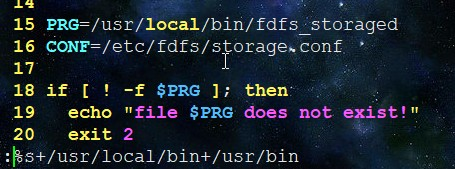

# FastDFS服务器单机搭建

## 第一步  搭建Linux虚拟机环境

因为 ***FastDFS*** 必须在 Linux 系统上运行，所以这里准备好 Linux 环境，笔者的是 ***CentOS7***, 并且是最小化安装，

这里提供 *VMware* 虚拟机下的最小化的安装包，初始用户是：*root*, 密码：*123456*，解压直接运行，安全无毒，可以放心使用。百度云：https://pan.baidu.com/s/1uxmDyhSueX7OIoRi6Auf0Q

## 第二步  配置虚拟机的静态IP

正常情况下我们的 **IP** 都是动态变化的，每次变化之后我们都要相应调整，很麻烦，所以这里固定一下 **IP**

**==步骤==**

+ 因为之后需要联网，我们必须设置虚拟机的网络适配器为 **NAT** 或者 **桥接模式**，但**不能**是 **仅主机** 模式， 否则不能联网


+ 打开 *VMware* 的虚拟网络编辑器: 菜单栏 ---》编辑 ---》虚拟网络编辑器

  

+ 查看 **NAT模式** 相关的参数（因为我刚刚配FastDFS虚拟机配的是 **NAT** 模式，所以这里查看 **NAT模式**的参数， 读者若是 **桥接模式**，这里请查看 **桥接模式** 的相关参数，但建议与笔者一致，因为这两种方式使用起来并没什么区别）


​	

​	记录相关参数：

​		子网IP：192.168.67.0

​		子网掩码：255.255.255.0

​		网关IP：192.168.67.2

+ 打开 ***FastDFS*** 虚拟机，修改 */etc/sysconfig/network-scripts/ifcfg-ens32* 文件，请注意，读者的网卡文件不一定是 *ifcfg-ens32*，但一定是 *ifcfg-xxx* 类型的文件名（*ifcfg-lo*除外）

  ```shell
  [root@fastdfs:# network-scripts] vi /etc/sysconfig/network-scripts/ifcfg-ens32
  TYPE=Ethernet
  PROXY_METHOD=none
  BROWSER_ONLY=no
  BOOTPROTO=static			# 将 dhcp(动态分配) 改成 static
  DEFROUTE=yes
  IPV4_FAILURE_FATAL=no
  IPV6INIT=yes
  IPV6_AUTOCONF=yes
  IPV6_DEFROUTE=yes
  IPV6_FAILURE_FATAL=no
  IPV6_ADDR_GEN_MODE=stable-privacy
  NAME=ens32
  UUID=c119b162-a6a5-4f59-9176-5c8d9b1759d2
  DEVICE=ens32
  ONBOOT=yes					# 改成 yes, 刚装的时候可能是 no
  IPADDR=192.168.67.132		# 设置FastDFS的IP, 重要自己随便起一个(192.168.67.1~192.168.67.254)
  GATEWAY=192.168.67.2		# 填入刚才记录的网关IP
  NETMASK=255.255.255.0		# 填入刚才记录的子网掩码
  DNS1=192.168.67.2			# 与 GATEWAY 一致
  ```

  以上读者视实际情况改动

  建议在读者自己的Windows和FastDFS的 *host* 文件中都添加一个好记的名称，添加了之后等下配置的时候可以直接使用，省的多次写 IP。（至于这个文件是什么学过 *计算机网络*  的童鞋应该清楚，不清出的可以百度，这里不再赘述）

  ```shell
  [root@fastdfs:# etc] vi /etc/hosts
  127.0.0.1   localhost localhost.localdomain localhost4 localhost4.localdomain4
  ::1         localhost localhost.localdomain localhost6 localhost6.localdomain6
  192.168.67.132  fastdfs.com		# 我加的是 fastdfs.com
  
  ```

  

  在Windows中无法改动 *hosts* 文件的读者可以右键 *hosts* 文件，属性，更改一下权限，修改完之后记得把权限改回来！具体方法百度。。

+ 设置好 **IP** 之后可以重启或 *service network restart* 让改动生效

## 第三步  安装 VIM

```shell
[root@fastdfs:# etc] yum install -y vim
```

安装之后如果想让 ***vim*** 编辑界面好看点可以修改 */etc/vimrc* 文件，不改也没关系的

```shell
root@fastdfs:# etc] vim /etc/vimrc
......
set nu				显示行号
set ts=4			table键为4个字符
set smartindent		智能换行
......
```


## 第四步  安装 gcc/g++ 编译器

因为 ***FastDFS*** 是源码，必须要经过编译才能安装，所以 *gcc* 编译器必不可少

```shell
[root@fastdfs:# etc] yum install -y gcc gcc-c++
```


## 第五步  上传安装包到 FastDFS 服务器

这里笔者提供好了：https://pan.baidu.com/s/17ewWvb8iYy_fgzJzn_HI6w

想自己下载的读者可以自行百度


## 第六步  安装 libfastcommon

1. 解压

```shell
[root@fastdfs:# software] tar -xvf libfastcommon-1.0.7.tar.gz
```

2. 进入解压后的目录

```shell
[root@fastdfs:# software] cd libfastcommon-1.0.7
[root@fastdfs:# libfastcommon-1.0.7] ls
HISTORY  INSTALL  libfastcommon.spec  make.sh  README  src
[root@fastdfs:# libfastcommon-1.0.7]
```

3. 编译

```shell
[root@fastdfs:# libfastcommon-1.0.7] ./make.sh 
```

4. 安装

```shell
[root@fastdfs:# libfastcommon-1.0.7] ./make.sh install
```


## 第七步  创建软连接

```shell
[root@fastdfs:# libfastcommon-1.0.7] ln -s /usr/lib64/libfastcommon.so /usr/local/lib/libfastcommon.so
[root@fastdfs:# libfastcommon-1.0.7] ln -s /usr/lib64/libfastcommon.so /usr/lib/libfastcommon.so
[root@fastdfs:# libfastcommon-1.0.7] ln -s /usr/lib64/libfdfsclient.so /usr/local/lib/libfdfsclient.so
[root@fastdfs:# libfastcommon-1.0.7] ln -s /usr/lib64/libfdfsclient.so /usr/lib/libfdfsclient.so
```


## 第八步  安装FastDFs

进入安装包文件夹，解压FastDFS压缩包

```shell
[root@fastdfs:# software] tar -xvf fastdfs-5.05.tar.gz
```

进入解压后的目录，编译，安装

```shell
[root@fastdfs:# software] cd fastdfs-5.05
[root@fastdfs:# fastdfs-5.05] ./make.sh
[root@fastdfs:# fastdfs-5.05] ./make.sh install
```


## 第九步  查看是否安装成功

+ 查看 */etc/init.d/* 文件夹是否有相关文件

```shell
[root@fastdfs:# fastdfs-5.05] cd /etc/init.d/ && ls | grep fdfs
fdfs_storaged
fdfs_trackerd
[root@fastdfs:# fastdfs-5.05]
```

+ 查看配置文件是否存在

```shell
[root@fastdfs:# fdfs] cd /etc/fdfs/ ; ls | grep sample
client.conf.sample
storage.conf.sample
tracker.conf.sample
[root@fastdfs:# fdfs] 
```

+ 查看相关的脚本是否已经安装

```shell
[root@fastdfs:# ~] cd /usr/bin/ && ls | grep fdfs
fdfs_appender_test
fdfs_appender_test1
fdfs_append_file
fdfs_crc32
fdfs_delete_file
fdfs_download_file
fdfs_file_info
fdfs_monitor
fdfs_storaged
fdfs_test
fdfs_test1
fdfs_trackerd
fdfs_upload_appender
fdfs_upload_file
[root@fastdfs:# bin]
```


## 第十步  修改配置文件

因为 FastDFS 服务脚本设置的 bin 目录为 /usr/local/bin/ 下,但是实际我们安
装在了 /u sr/bin/ 下面。所以我们需要修改 FastDFS 配置文件中的路径，也就是
需要修改两个配置文件

 修改 */etc/init.d/fdfs_storaged*

在命令模式下替换字符串， 底行输入  “*:%s+/usr/local/bin+/usr/bin*”

```shell
[root@fastdfs:# bin] vim /etc/init.d/fdfs_storaged
```



提示有7处修改

同样的，修改 *vim /etc/init.d/fdfs_trackerd*

```shell
[root@fastdfs:# bin] vim /etc/init.d/fdfs_trackerd
```


提示有7处修改


## 第十一步  配置跟踪器

+ 进入到 /etc/fdfs 目录并且复制一份 tracker.conf.sample 并命名为
  tracker.conf

```shell
[root@fastdfs:# bin] cd /etc/fdfs/
[root@fastdfs:# fdfs] cp tracker.conf.sample tracker.conf
[root@fastdfs:# fdfs] vim /etc/fdfs/tracker.conf	# 修改 base_path 为 /opt/fdfs/tracker，这是一个目录，自己可以随意指定，目前还不存在，等下再创建
```


+ 创建 *FastDFS* 的文件夹

```shell
[root@fastdfs:# opt] mkdir -p /opt/fdfs/tracker		# -p 选项表示创建多级目录
```

+ 添加防火墙规则

  修改 */etc/sysconfig/iptables* 文件, 添加 *-A INPUT -m state --state NEW -m tcp -p tcp --dport 22122 -j ACCEPT*

  ```shell
  [root@fastdfs:# opt] vim /etc/sysconfig/iptables
  ```

  


+ 重启防火墙

```shell
[root@fastdfs:# opt] service iptables restart
Redirecting to /bin/systemctl restart iptables.service
[root@fastdfs:# opt]
```

+ ==启动 */etc/init.d/fdfs_trackerd start*==

```shell
[root@fastdfs:# opt] /etc/init.d/fdfs_trackerd start
Starting fdfs_trackerd (via systemctl):                    [  确定  ]
[root@fastdfs:# opt] 
```

+ 查看 *tracker* 文件夹下多了两个文件夹 *data* 和 *logs*

```shell
[root@fastdfs:# opt] ls /opt/fdfs/tracker/
data  logs
[root@fastdfs:# opt] 
```

+ ==设置 *tracker* 开机自启动==

  在 rc.local 文件中添加 /etc/init.d/fdfs_trackerd start

```shell
[root@fastdfs:# opt] vim /etc/rc.d/rc.local 
  1 #!/bin/bash
  2 # THIS FILE IS ADDED FOR COMPATIBILITY PURPOSES
  3 #
  4 # It is highly advisable to create own systemd services or udev rules
  5 # to run scripts during boot instead of using this file.
  6 #
  7 # In contrast to previous versions due to parallel execution during boot
  8 # this script will NOT be run after all other services.
  9 #
 10 # Please note that you must run 'chmod +x /etc/rc.d/rc.local' to ensure
 11 # that this script will be executed during boot.
 12 
 13 touch /var/lock/subsys/local
 14 /etc/init.d/fdfs_trackerd start		# 添加这个
```


## 第十二步 配置 FastDFS 存储

+ 进入 */etc/fdfs* 目录，复制一份 *storage.conf.sample* 文件并命名为
  *storage.conf* 

```shell
[root@fastdfs:# opt] cd /etc/fdfs/
[root@fastdfs:# fdfs] cp storage.conf.sample storage.conf
```

+ 修改存储文件 *storage.conf*

```shell
[root@fastdfs:# fdfs] vim storage.conf
```

+ 修改以下四项

```shell
。。。。
40 # the base path to store data and log files
41 base_path=/opt/fdfs/storage	# 此目录读者可以酌情修改，并非固定，但建议与笔者一致
。。。
107 # store_path#, based 0, if store_path0 not exists, it's value is base_path
108 # the paths must be exist
109 store_path0=/opt/fdfs/storage
。。。。
116 # tracker_server can ocur more than once, and tracker_server format is
117 #  "host:port", host can be hostname or ip address
118 tracker_server=fastdfs.com:22122	# 注意，这里填自己的FastDFS虚拟机的IP:端口号, 比如：192.168.67.133:22122，因为笔者先前在 /etc/hosts 文件中有过设置，所以也可以写 fastdfs.com:22122，这样好记，也利于修改
。。。。
280 # the port of the web server on this storage server
281 http.server_port=8888		# 8888 不是固定的，读者可以酌情修改，但建议与笔者一致
```

+ 创建存储目录

```shell
[root@fastdfs:# fdfs] mkdir -p /opt/fdfs/storage
```

+ 修改防火墙，允许外界访问 storage 的默认端口 23000

```shell
[root@fastdfs:# fdfs] vim /etc/sysconfig/iptables
```


+ 重启防火墙

```shell
[root@fastdfs:# ~] service iptables restart
Redirecting to /bin/systemctl restart iptables.service
[root@fastdfs:# ~] 
```

+ 查看生成目录，在防火墙重启之后，==启动 *srotage*, */opt/fdfs/storage/*==目录会生成 *data* 和 *logs* 两个文件夹

```shell
[root@fastdfs:# storage] /etc/init.d/fdfs_storaged start
[root@fastdfs:# ~] cd /opt/fdfs/storage/
[root@fastdfs:# storage] ll
总用量 12
drwxr-xr-x. 259 root root 8192 12月 19 21:36 data
drwxr-xr-x.   2 root root   26 11月 29 20:06 logs
[root@fastdfs:# storage] 
```

## 第十三步  验证 FastDFS tracker 和 storage 是否启动成功

```shell
[root@fastdfs:# init.d] ps -ef | grep fdfs
root       1201      1  0 12:19 ?        00:00:00 /usr/bin/fdfs_trackerd /etc/fdfs/track
root       1226      1  0 12:19 ?        00:00:00 /usr/bin/fdfs_storaged /etc/fdfs/stora
root       2217   1139  0 12:22 pts/0    00:00:00 grep --color=auto fdfs
[root@fastdfs:# init.d]
```

进入到 */fastdfs/storage/data/* 目录下，可以看到两级共 256*256 个目录，每级都是从 00 到 FF，如下只是列出了第一级的目录， 点进去每个目录都还有 00 到 FF共 256 个目录

```shell
[root@fastdfs:# init.d] cd /opt/fdfs/storage/data/
[root@fastdfs:# data] ls
00  12  24  36  48  5A  6C  7E  90  A2  B4  C6  D8  EA  FC
01  13  25  37  49  5B  6D  7F  91  A3  B5  C7  D9  EB  FD
02  14  26  38  4A  5C  6E  80  92  A4  B6  C8  DA  EC  fdfs_storaged.pid
03  15  27  39  4B  5D  6F  81  93  A5  B7  C9  DB  ED  FE
04  16  28  3A  4C  5E  70  82  94  A6  B8  CA  DC  EE  FF
05  17  29  3B  4D  5F  71  83  95  A7  B9  CB  DD  EF  M00
06  18  2A  3C  4E  60  72  84  96  A8  BA  CC  DE  F0  storage_stat.dat
07  19  2B  3D  4F  61  73  85  97  A9  BB  CD  DF  F1  sync
08  1A  2C  3E  50  62  74  86  98  AA  BC  CE  E0  F2
09  1B  2D  3F  51  63  75  87  99  AB  BD  CF  E1  F3
0A  1C  2E  40  52  64  76  88  9A  AC  BE  D0  E2  F4
0B  1D  2F  41  53  65  77  89  9B  AD  BF  D1  E3  F5
0C  1E  30  42  54  66  78  8A  9C  AE  C0  D2  E4  F6
0D  1F  31  43  55  67  79  8B  9D  AF  C1  D3  E5  F7
0E  20  32  44  56  68  7A  8C  9E  B0  C2  D4  E6  F8
0F  21  33  45  57  69  7B  8D  9F  B1  C3  D5  E7  F9
10  22  34  46  58  6A  7C  8E  A0  B2  C4  D6  E8  FA
11  23  35  47  59  6B  7D  8F  A1  B3  C5  D7  E9  FB
[root@fastdfs:# data] 
```

+ ==设置 storage 开机自启动，添加一行 /etc/init.d/fdfs_storaged start== 

```shell
root@fastdfs:# data] vim /etc/rc.local
  1 #!/bin/bash
  2 # THIS FILE IS ADDED FOR COMPATIBILITY PURPOSES
  3 #
  4 # It is highly advisable to create own systemd services or udev rules
  5 # to run scripts during boot instead of using this file.
  6 #
  7 # In contrast to previous versions due to parallel execution during boot
  8 # this script will NOT be run after all other services.
  9 #
 10 # Please note that you must run 'chmod +x /etc/rc.d/rc.local' to ensure
 11 # that this script will be executed during boot.
 12 
 13 touch /var/lock/subsys/local
 14 /etc/init.d/fdfs_trackerd start
 15 /etc/init.d/fdfs_storaged start		# 添加这一行
```

## 第十四步  修改 *client.conf* 配置文件

+ 进入到 */etc/fdfs* 目录下并复制一份 *client.conf.sample* 并更名为 *client.conf*

```shell
[root@fastdfs:# data] cd /etc/fdfs
[root@fastdfs:# fdfs] cp client.conf.sample client.conf
[root@fastdfs:# fdfs] vim /etc/fdfs/client.conf 
......
 9 # the base path to store log files
 10 base_path=/opt/fdfs/tracker		# 修改这里，这是一个目录，等下需创建
 11 
 12 # tracker_server can ocur more than once, and tracker_server format is
 13 #  "host:port", host can be hostname or ip address
 14 tracker_server=fastdfs.com:22122	# 指定虚拟机IP, 跟先前一样，读者视实际情况修改
......
```

## 第十五步  测试上传文件

笔者这里准备了一张图片用来测试文件上传

```shell
[root@fastdfs:# software] ls
12.jpg               fastdfs-nginx-module               libfastcommon-1.0.7.tar.gz
fastdfs-5.05         fastdfs-nginx-module_v1.16.tar.gz  nginx-1.6.2
fastdfs-5.05.tar.gz  libfastcommon-1.0.7                nginx-1.6.2.tar.gz
[root@fastdfs:# software] 
```

+ 使用 fdfs_upload_file 脚本进行文件上传操作

```shell
[root@fastdfs:# software]  /usr/bin/fdfs_upload_file /etc/fdfs/client.conf /root/software/12.jpg 
group1/M00/00/00/wKhDhFwbRyaAEAaRAAYghmrYqsg575.jpg
[root@fastdfs:# software] 
```

可见，已经上传成功，返回的是文件存储的位置


## 第十六步  安装 nginx

+ 准备 *nginx* 安装包，这里笔者已经准备好了


+ 先安装依赖

```shell
yum install -y pcre pcre-devel
yum install -y zlib zlib-devel
yum install -y openssl openssl-devel
```


+ 解压缩

```shell
[root@fastdfs:# software] tar -xvf nginx-1.6.2.tar.gz 
```

+ 预编译 & 安装

```shell
[root@fastdfs:# software] cd nginx-1.6.2
[root@fastdfs:# nginx-1.6.2] ./configure --prefix=/usr/local/nginx
checking for OS
 + Linux 3.10.0-862.14.4.el7.x86_64 x86_64
checking for C compiler ... found
 + using GNU C compiler
 + gcc version: 4.8.5 20150623 (Red Hat 4.8.5-36) (GCC) 
checking for gcc -pipe switch ... found
checking for gcc builtin atomic operations ... found
......
```

```shell
[root@fastdfs:# nginx-1.6.2] make && make install
```

+ 启动 *nginx*

```shell
[root@fastdfs:# software] /usr/local/nginx/sbin/nginx 
ngx_http_fastdfs_set pid=2416
[root@fastdfs:# nginx-1.6.2] ps -ef | grep nginx	# 查看 nginx 是否启动
root       2417      1  0 15:43 ?        00:00:00 nginx: master process /usr/local/nginx/sbin/nginx
nobody     2418   2417  0 15:43 ?        00:00:00 nginx: worker process
root       4318   2388  0 15:51 pts/1    00:00:00 grep --color=auto nginx
[root@fastdfs:# nginx-1.6.2] 
```


## 第十七步  安装 FastDFS 与 Nginx 的依赖包

+ 准备安装包 *fastdfs-nginx-module_v1.16.tar.gz*

  笔者已经在前面的百度盘连接中提供，有其他需要的读者可以自行百度

+ 同样，解压，安装，这里直接上过程，不做多余赘述

```shell
[root@fastdfs:# software] tar -xvf fastdfs-nginx-module_v1.16.tar.gz 
...
[root@fastdfs:# software] cd fastdfs-nginx-module/src/
[root@fastdfs:# src] ls
common.c  common.h  config  mod_fastdfs.conf  ngx_http_fastdfs_module.c
[root@fastdfs:# src] 
```

+ 修改 *config* 文件，把文件的第四行配置中的 */usr/local/include* 都改为*/usr/include*，共两处。

```shell
[root@fastdfs:# src] vim config 
  1 ngx_addon_name=ngx_http_fastdfs_module
  2 HTTP_MODULES="$HTTP_MODULES ngx_http_fastdfs_module"
  3 NGX_ADDON_SRCS="$NGX_ADDON_SRCS $ngx_addon_dir/ngx_http_fastdfs_module.c"
  4 CORE_INCS="$CORE_INCS /usr/include/fastdfs /usr/include/fastcommon/"
  5 CORE_LIBS="$CORE_LIBS -L/usr/local/lib -lfastcommon -lfdfsclient"
  6 CFLAGS="$CFLAGS -D_FILE_OFFSET_BITS=64 -DFDFS_OUTPUT_CHUNK_SIZE='256*1024' -DFDFS_M
    OD_CONF_FILENAME='\"/etc/fdfs/mod_fastdfs.conf\"'"
~                                                               
```

+ 为了将 nginx 与 fastdfs 相结合，我们先把这个  */usr/local/nginx* 目录删除掉

```shell
[root@fastdfs:# src] cd /usr/local/
[root@fastdfs:# local] ls | grep nginx
nginx
[root@fastdfs:# local] rm -rf nginx
```

+ 进入到 nginx-1.6.2/ 目录下并执行配置和编译安装

```shell
[root@fastdfs:# local] cd ~/software/nginx-1.6.2
[root@fastdfs:# nginx-1.6.2] ls
[root@fastdfs:# nginx-1.6.2]  ./configure --add-module=/root/software/fastdfs-nginx-module/src	# 就是依赖包的位置
[root@fastdfs:# nginx-1.6.2] make && make install
```

+ 复制 *fastdfs-nginx-module* 中的配置文件，到 */etc/fdfs* 目录中

```shell
[root@fastdfs:# src] cd /root/software/fastdfs-nginx-module/src
[root@fastdfs:# src] ls
common.c  common.h  config  mod_fastdfs.conf  ngx_http_fastdfs_module.c
[root@fastdfs:# src] cp mod_fastdfs.conf /etc/fdfs/
```

+ 复制之后修改 */etc/fdfs/mod_fastdfs.conf*

  需要修改的项如下，其中第一项是超时时长，第二项是指定IP和端口，第三项是允许外界通过 http 方式访问资源

```shell
 1 # connect timeout in seconds
 2 # default value is 30s
 3 connect_timeout=10
 ......
 37 # FastDFS tracker_server can ocur more than once, and tracker_server format is
 38 #  "host:port", host can be hostname or ip address
 39 # valid only when load_fdfs_parameters_from_tracker is true
 40 tracker_server=fastdfs.com:22122	# 视读者实际情况填写
 ......
 49 # if the url / uri including the group name
 50 # set to false when uri like /M00/00/00/xxx
 51 # set to true when uri like ${group_name}/M00/00/00/xxx, such as group1/M00/xxx
 52 # default value is false
 53 url_have_group_name = true
 ......
 59 # store_path#, based 0, if store_path0 not exists, it's value is base_path
 60 # the paths must be exist
 61 # must same as storage.conf
 62 store_path0=/opt/fdfs/storage		# 视读者实际情况填写
 ......
```

+ 复制 FastDFS 里的 2 个文件，到 */etc/fdfs* 目录中

```shell
[root@fastdfs:# conf] cd /root/software/fastdfs-5.05/conf
[root@fastdfs:# conf] ls
anti-steal.jpg  http.conf   storage.conf      tracker.conf
client.conf     mime.types  storage_ids.conf
[root@fastdfs:# conf] cp http.conf mime.types /etc/fdfs/
```

+ 创建一个软连接， 在 */opt/fdfs/storage* 文件存储目录下创建软连接， 将其链接到
  实际存放数据 的目录

```shell
[root@fastdfs:# storage] ln -s /opt/fdfs/storage/data/ /opt/fdfs/storage/data/M00
```

## 第十八步  修改 nginx 的配置文件

```shell
[root@fastdfs:# storage] cd /usr/local/nginx/conf/
[root@fastdfs:# conf] vim nginx.conf
......
 35     server {
 36         listen       8888;		# 修改这里
 37         server_name  localhost;
 38 
 39         #charset koi8-r;
 40 
 41         #access_log  logs/host.access.log  main;
 42 
 43         location ~/group([0-9])/M00 {	# 修改这里
 44         ngx_fastdfs_module;
 45             root   html;
 46             index  index.html index.htm;
 47         }
 48 
......
```

+ 设置 nginx 开机自启动，这样下次重启设备之后，*tracker* 、*storage* 、*nginx* 都自动启动了，直接就可以使用服务

```shell
[root@fastdfs:# conf] vim /etc/rc.d/rc.local
  1 #!/bin/bash
  2 # THIS FILE IS ADDED FOR COMPATIBILITY PURPOSES
  3 #
  4 # It is highly advisable to create own systemd services or udev rules
  5 # to run scripts during boot instead of using this file.
  6 #
  7 # In contrast to previous versions due to parallel execution during boot
  8 # this script will NOT be run after all other services.
  9 #
 10 # Please note that you must run 'chmod +x /etc/rc.d/rc.local' to ensure
 11 # that this script will be executed during boot.
 12 
 13 touch /var/lock/subsys/local
 14 /etc/init.d/fdfs_trackerd start
 15 /etc/init.d/fdfs_storaged start
 16 /usr/local/nginx /sbin/nginx
~                                    
```

+ ==启动 nginx==

```shell
[root@fastdfs:# conf] /usr/local/nginx/sbin/nginx
ngx_http_fastdfs_set pid=4718
```

+ 在通过 8888 端口访问图片之前先配置下防火墙，允许外界访问 8888 端口

+ 配置完防火墙后重启防火墙

==OK! 大功告成！！！==


现在，可以在你的Windows的浏览器中观察是否可以看到刚才上传的图片

在浏览器中输入：http://fastdfs.com:8888/group1/M00/00/00/wKhDhFwbRyaAEAaRAAYghmrYqsg575.jpg


